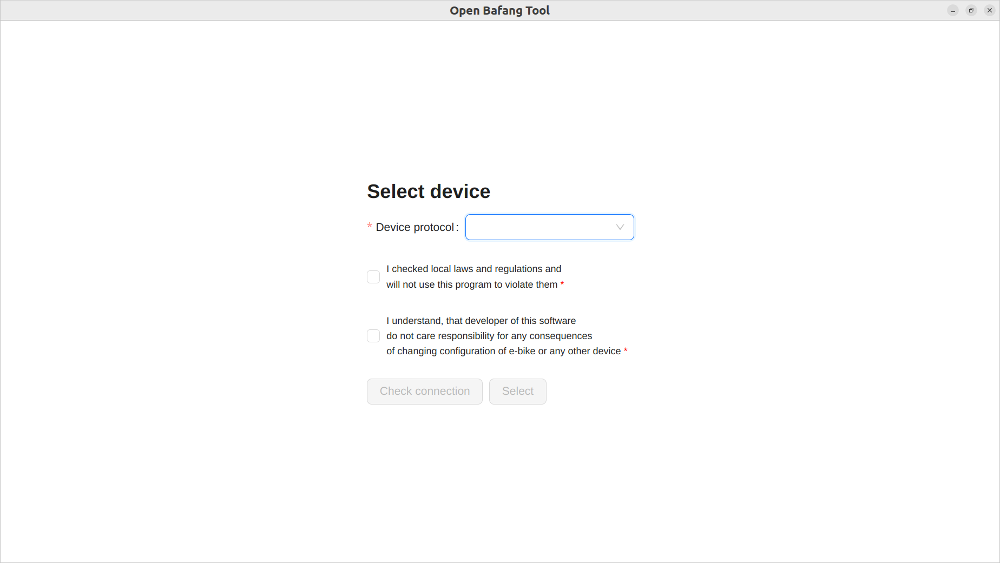
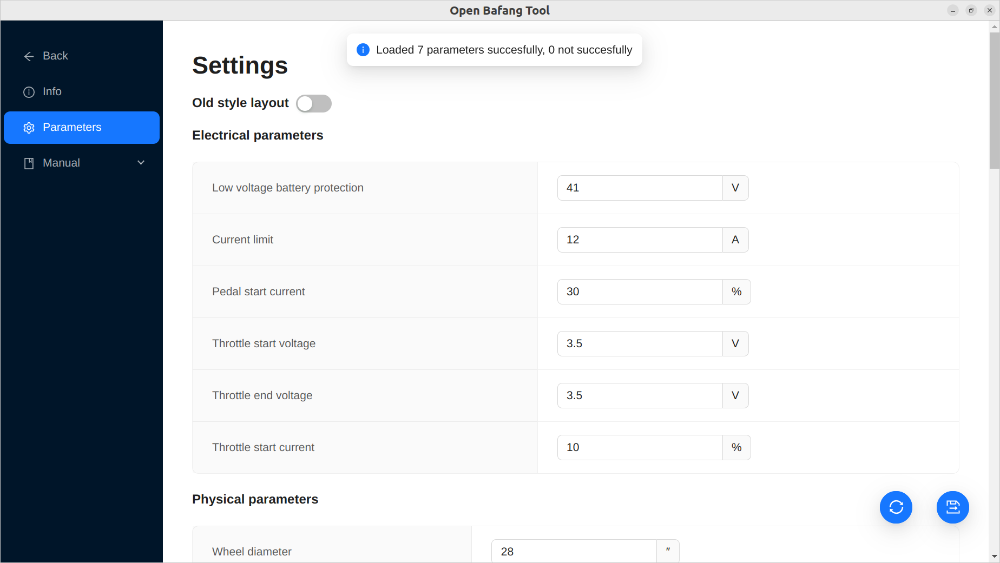
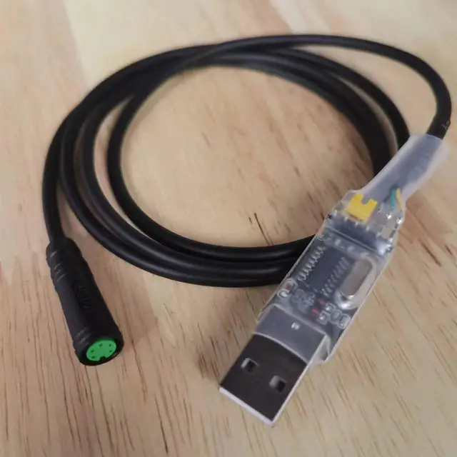
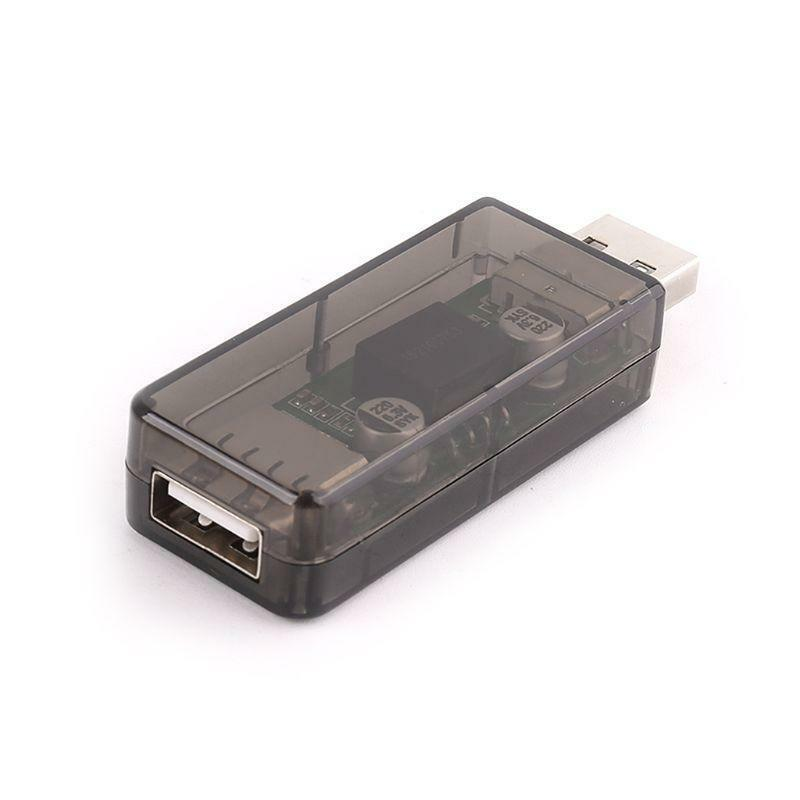

[![Issues][issues-shield]][issues-url]
[![MIT License][license-shield]][license-url]

 

<h3 align="center">OpenBafangTool</h3>

  

    Open-source e-bike Configuration&Diagnostics software - tune your Bafang BBS01, BBS02, BBSHD and more
     
    <a href="docs"><strong>Explore the docs</strong></a>
     
     
    <a href="https://github.com/andrey-pr/OpenBafangTool/releases">Releases</a>
    ·
    <a href="https://github.com/andrey-pr/OpenBafangTool/issues">Report Bug</a>
    ·
    <a href="https://github.com/andrey-pr/OpenBafangTool/issues">Request Feature</a>
  

<!-- RELEASE NOTES -->
## Release Notes

### 1.0.1

- Published project in Beta
- Added Simplified Mode for beginners

### 1.0.0

- Published first version in Alpha

<!-- ABOUT THE PROJECT -->
## About The Project

**Warning! This project in beta version, so use it carefully. If you have any problems, write in [Issues](https://github.com/andrey-pr/OpenBafangTool/issues)**

**Please report about your expirience of using this program on [forum](https://endless-sphere.com/sphere/threads/openbafangtool-new-open-source-bafang-configuration-tool.122809) to help me make programm better**

The goal of project is to replace official diagnostic tools for ebikes, that available only for official dealers, with open source alternative to let people repair and configure their bikes at home. For example, you can read and erase error codes, or limit power if physical power of your motor is too big for your country rules (possibilities depend on motor brand and model). Second goal of project is to document protocols of as much systems as possible to let other developers use them in their projects.

Currently this program supports only Bafangs with UART and have nearly same functions as [Stefan Penoff's Bafang Configuration Tool](https://penoff.me/2016/01/13/e-bike-conversion-software/), but I have plan to improve it. Right now I'm working on hacking Yamaha protocol, Bafang with CAN and Brose planned later. So you can configure motors like BBS01, BBS02, BBSHD and some other mid-drive models.

(<a href="#readme-top">back to top</a>)

<!-- GETTING STARTED -->
## Getting Started

You can download executables for Windows and Linux (AppImage) [here](https://github.com/andrey-pr/OpenBafangTool/releases)

### Prerequisites

Minimal set of hardware that you need to use this program (also possible to test program in simulator mode without real hardware):

Programming cable for bafang - you can buy it on Aliexpress for 5$ or in local shops.

Motor that you want to configure.

Also better to have USB isolator, that will protect your computer in case when motor or connection cable is broken and put battery voltage (usually 36V or 48V) on USB connector.

### Installation

Current build of program are portable, so just download executable and launch it. Also, if you use Linux, you may need to unblock your serial ports in way, dependent on your distributive.

(<a href="#readme-top">back to top</a>)

<!-- USAGE EXAMPLES -->
## Usage

There are docs on each parameter [here](docs/Bafang%20UART%20motor%20parameters.md) or you can use any manual from internet. Here is some examples what you can do with this parameters:

1. You can set wheel size when you want to install motor kit on your bike, to show correct speed on display.
2. You can adjust speed limit or current limit to comply with local rules, if they are different from default value. **Its strongly not recommended to set limit higher than its allowed in your region!**
3. According user reports, some motor modifications starts only after one full pedal rotation - in that case, you can lower parameter "Signal No." to start motor after quarter of rotation or less.

(<a href="#readme-top">back to top</a>)

<!-- ROADMAP -->
## Roadmap

- [ ] Add support of Bafang motors with UART
  - [x] Find hardware
  - [x] Alpha
  - [x] Beta
  - [ ] Stable
- [ ] Add support of Yamaha systems
  - [ ] Find hardware
  - [x] Research protocol - in progress
  - [ ] Alpha
  - [ ] Beta
  - [ ] Stable
- [ ] Add support of Bafang systems with CAN
  - [ ] Find hardware - in progress
  - [ ] Alpha
  - [ ] Beta
  - [ ] Stable
- [ ] Add support of Bafang displays with UART
- [ ] Add support of Panasonic systems
- [ ] Add more kinds of executables
  - [x] .dmg - MacOS, on Apple Silicon and x86_64
  - [ ] Flatpak - Linux, x86_64 - in progress
- [ ] Add multi-language interface
- [x] Add simple mode for beginners

You can open [issue](https://github.com/andrey-pr/OpenBafangTool/issues) for request a new feature.

(<a href="#readme-top">back to top</a>)

<!-- LICENSE -->
## License

Distributed under the MIT License. See `LICENSE.txt` for more information.

(<a href="#readme-top">back to top</a>)

<!-- CONTACT -->
## Contact

[Forum topic](https://endless-sphere.com/sphere/threads/openbafangtool-new-open-source-bafang-configuration-tool.122809)

[Issues](https://github.com/andrey-pr/OpenBafangTool/issues)

Project Link: [https://github.com/andrey-pr/OpenBafangTool](https://github.com/andrey-pr/OpenBafangTool)

(<a href="#readme-top">back to top</a>)

<!-- ACKNOWLEDGMENTS -->
## Acknowledgments

* [Stefan Penoff - author of original Bafang Configuration Tool project](https://penoff.me/2016/01/13/e-bike-conversion-software/)

(<a href="#readme-top">back to top</a>)

<!-- MARKDOWN LINKS & IMAGES -->
<!-- https://www.markdownguide.org/basic-syntax/#reference-style-links -->
[issues-shield]: https://img.shields.io/github/issues/andrey-pr/OpenBafangTool.svg?style=for-the-badge
[issues-url]: https://github.com/andrey-pr/OpenBafangTool/issues
[license-shield]: https://img.shields.io/github/license/andrey-pr/OpenBafangTool.svg?style=for-the-badge
[license-url]: LICENSE.txt
