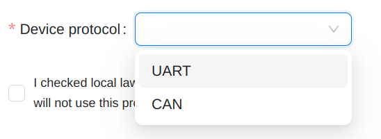
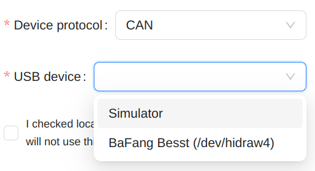
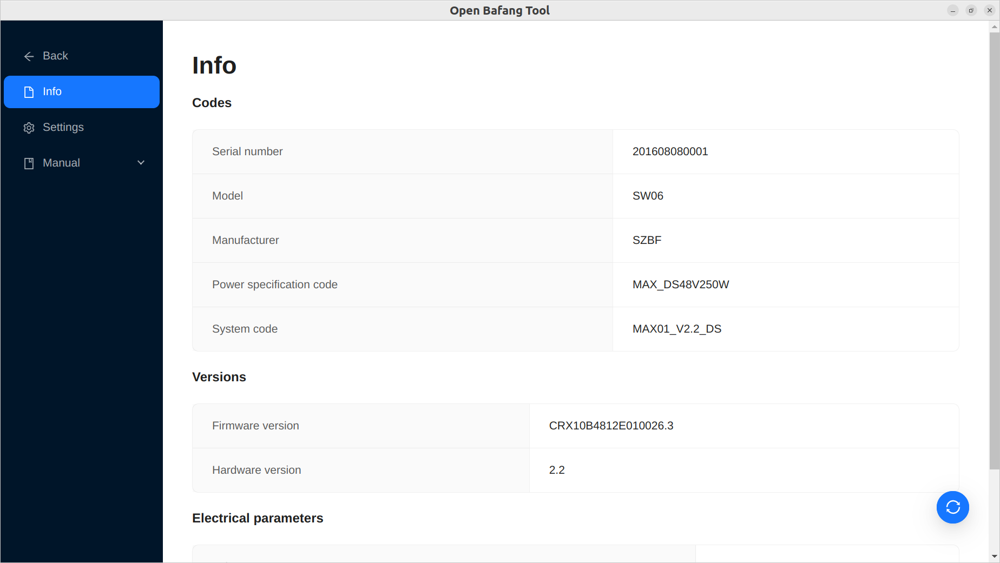
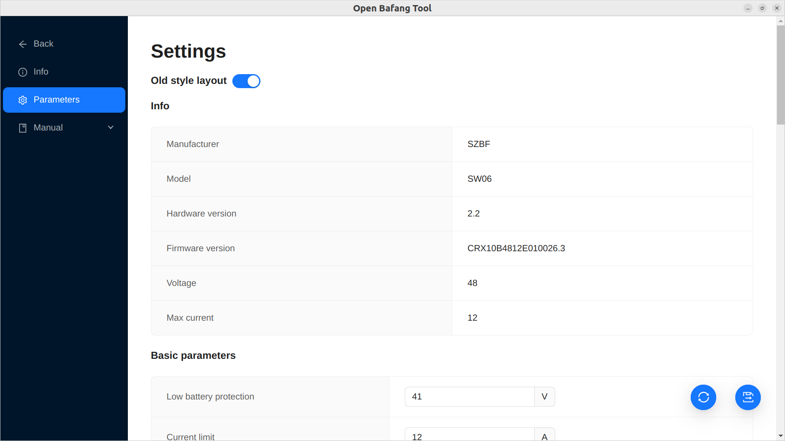

## General manual

#### Device selection view

This is the first view of program, that appears aften launch. Here you can choose what device do you want to interact and interface type (simplified or full).

At first, select type of your electric system. Old bafangs such as BBS01/02/HD have UART protocol (you can also recognize them by round green connector), new have CAN protocol (you can recognize then by "house-shaped" green connnector).

For systems with UART available two kinds of UI - full and simplified. If you are newbie, better to select simplified mode.

If you have motor with UART, select port where you device connected to. Check usual name of USB-Serial ports for you operational system in internet. Also, there is a item `Simulator` that connects program to virtual device for test purposes and virtual `/dev/tnt` ports if you have them in your system (available only for Linux). Non-USB serial ports usually removed from list on Linux due to high ammount of "dead" ports in standard list.

If you have motor with CAN, select your BESST Tool USB device. Also, there is a item `Simulator` that connects program to virtual device for test purposes.

There are disclaimer checkbox, you should select them.

Then press button "Check Connection". If connection is successful, press "Select". In not, check device type, port, cable and device.

#### Main view (CAN)

TODO

#### Main view (UART, UI Simplified mode)

This is a main view of program. Here you can configurate device and see docs for it.

This is a side menu. Button "Back" closes connection and opens device selection view. Button "Parameters" opens page with parameters that you can change (check out docs for parameters of your device). Button "Manual" opens list of docs, available for your device except complicated technical data, that you need only in full mode. 

When you enter unusual value to parameter field, you will get warning about it. Note, that this function is not absolutely reliable and you may not get warning even for wrong value or get wrong warning for correct value.

Button with arrows means "read all data from device again". Button with rocket means "write all data to device".

After reading or writing you will get notifications with result (success or error).\
⚠️ If you got a write error of some parameter, it means that its too low or too big even if you got no warning from field. Also its possibble that you will get a new error after fixing previous - motor returns error answer only for first error value in package.

#### Main view (UART, UI Full mode)

This is a main view of program. Here you can configurate device and see docs for it.

This is a side menu. Button "Back" closes connection and opens device selection view. Button "Info" opens page with reand-only data from device. Button "Settings" opens page with parameters that you can change (check out docs for parameters of your device). Button "Manual" opens list of docs, available for your device.

When you entered unusual value to field on "Settings" page, you will get warning about it. Note, that this function is not absolutely reliable and you may not get warning even for wrong value or get wrong warning for correct value.

Button with arrows means "read all data from device again". Button with rocket means "write all data to device".

After reading or writing you will get notifications with result (success or error).\
⚠️ If you got a write error of some parameter, it means that its too low or too big even if you got no warning from field. Also its possibble that you will get a new error after fixing previous - motor returns error answer only for first error value in package.

If you prefer old parameter classification and names, like in original Stefan Penoff's program, turn on switch "Old style layout".